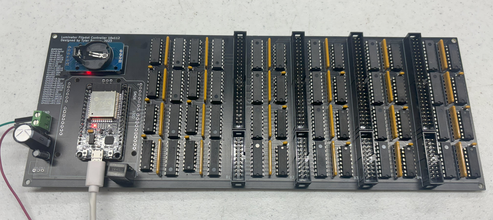
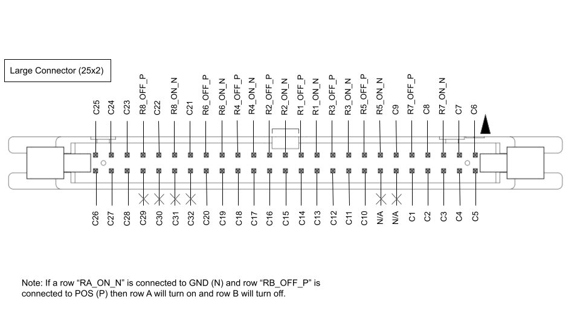
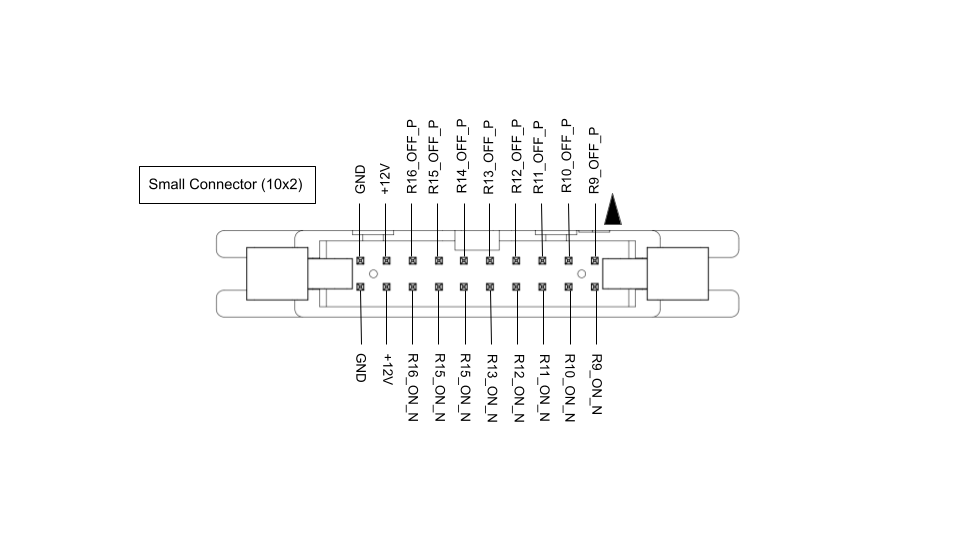

# Luminator Flipdot Display
 These signs were used in busses to display route information and service status, now they are replaced with led signs (how boring). Flipdots are physical disks "dots" that flip based on an electomagnetic impulse. The only original parts in this project are the flipdot boards themselves (and cables). Though the list is oversimplified, this is what I had to do:   
  * Reverse engineer pinnouts and board workings.
  * Design a PCB driver to drive the display (in Kicad).
  * Software to run on the driver board (C++ on esp32).
  * Software to control the driver board (Python on RPI).
  * Fabricate an enclosure to mount the boards and controllers.  

This project is on hold until I have time to complete the software and make some finishing touches to the housing.

## Pictures (videos in media folder too!)

### Finished (almost) display

### Board

### Populated Board

### Pinnouts

